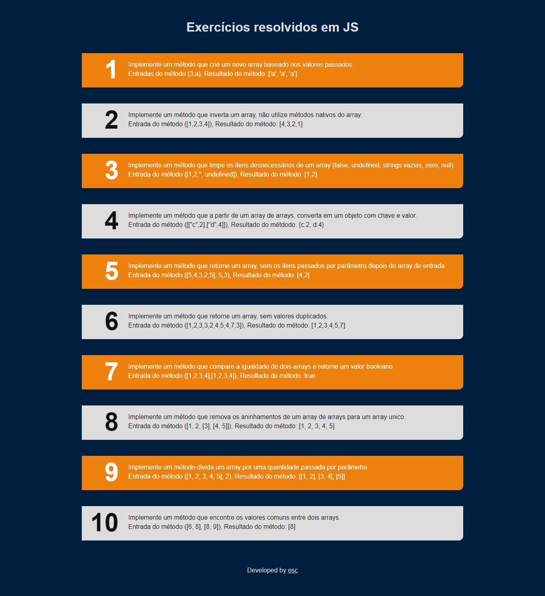
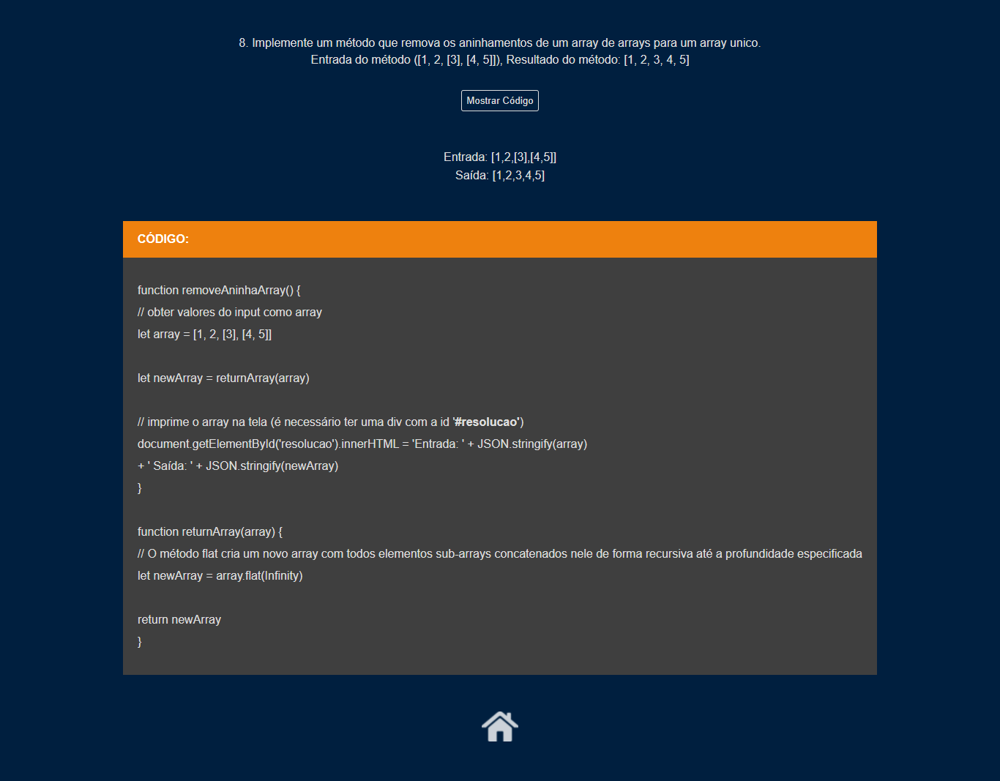

# TesteAlgoritmos
 Resolução de alguns Exercícios em JavaScript em forma de página WEB

1. Implemente um método que crie um novo array baseado nos valores passados. 
Entradas do método (3,a), Resultado do método: ['a', 'a', 'a']

2. Implemente um método que inverta um array, não utilize métodos nativos do array. 
Entrada do método ([1,2,3,4]), Resultado do método: [4,3,2,1]

3. Implemente um método que limpe os itens desnecessários de um array (false, undefined, strings vazias, zero, null). 
Entrada do método ([1,2,'', undefined]), Resultado do método: [1,2]

4. Implemente um método que a partir de um array de arrays, converta em um objeto com chave e valor. 
Entrada do método ([["c",2],["d",4]]), Resultado do métdodo: {c:2, d:4}

5. Implemente um método que retorne um array, sem os itens passados por parâmetro depois do array de entrada. 
Entrada do método ([5,4,3,2,5], 5,3), Resultado do método: [4,2]

6. Implemente um método que retorne um array, sem valores duplicados. 
Entrada do método ([1,2,3,3,2,4,5,4,7,3]), Resultado do método: [1,2,3,4,5,7]

7. Implemente um método que compare a igualdade de dois arrays e retorne um valor booleano. 
Entrada do método ([1,2,3,4],[1,2,3,4]), Resultado do método: true

8. Implemente um método que remova os aninhamentos de um array de arrays para um array unico. 
Entrada do método ([1, 2, [3], [4, 5]]), Resultado do método: [1, 2, 3, 4, 5]

9. Implemente um método divida um array por uma quantidade passada por parâmetro. 
Entrada do método ([1, 2, 3, 4, 5], 2), Resultado do método: [[1, 2], [3, 4], [5]]

10. Implemente um método que encontre os valores comuns entre dois arrays. 
Entrada do método ([6, 8], [8, 9]), Resultado do método: [8] 

